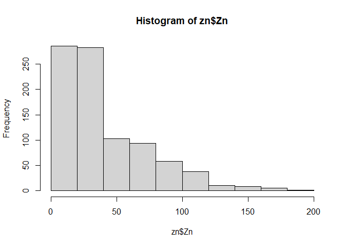
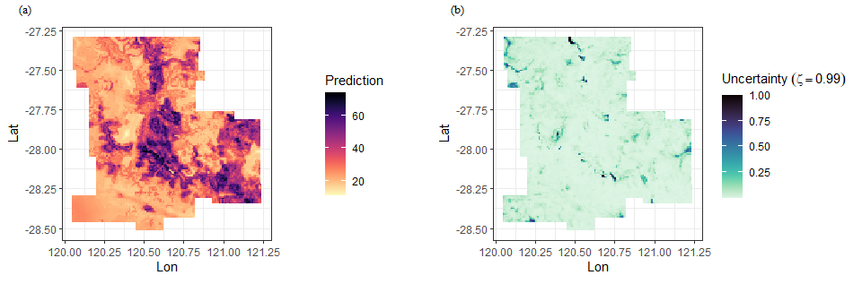

<!-- README.md is generated from README.Rmd. Please edit that file -->

# spEcula 

<!-- badges: start -->
<!-- badges: end -->

The goal of **spEcula** is to make it easier to use R for spatial
speculation based on *spatial dependence*, *spatial stratification
heterogeneity* and *geographical configuration similarity*.

## Installation

You can install the development version of `spEcula` like so:

``` r
# install.packages("devtools")
devtools::install_github("SpatLyu/spEcula")
```

## Example

### Computationally optimized geographically optimal similarity (GOS) model

`geosimilarity` package has achieved `gos` model,but when data is
larger,`geosimilarity` may be slow. I develop the parallelized `gos`
model in `spEcula`,which can change the `cores` argument in `gos()`
function to parallel computation.

``` r
library(spEcula)

hist(zn$Zn)
```



``` r
# log-transformation
zn$Zn = log(zn$Zn)
hist(zn$Zn)
```


``` r
system.time({
  g1 = gos(Zn ~ Slope + Water + NDVI  + SOC + pH + Road + Mine,
           data = zn, newdata = grid, kappa = 0.08,cores = 6)
})
##    user  system elapsed 
##    0.00    0.00    3.25
```

``` r
g1
## # A tibble: 13,132 × 7
##     pred uncertainty90 uncertainty95 uncertainty99 uncertainty99.5
##    <dbl>         <dbl>         <dbl>         <dbl>           <dbl>
##  1  3.08        0.0818        0.0523        0.0287         0.0243 
##  2  3.11        0.0529        0.0356        0.0102         0.00954
##  3  3.13        0.0693        0.0429        0.0224         0.0148 
##  4  3.12        0.0665        0.0572        0.0140         0.00799
##  5  3.09        0.0736        0.0460        0.0181         0.0139 
##  6  3.07        0.0728        0.0480        0.0200         0.0169 
##  7  3.14        0.0453        0.0345        0.0185         0.0178 
##  8  3.21        0.0488        0.0434        0.0227         0.0118 
##  9  3.22        0.0435        0.0432        0.0186         0.0103 
## 10  3.20        0.0217        0.0217        0.0182         0.0141 
## # ℹ 13,122 more rows
## # ℹ 2 more variables: uncertainty99.9 <dbl>, uncertainty100 <dbl>
```

``` r
library(ggplot2)
library(viridis)
## Loading required package: viridisLite
```

``` r
grid$pred = exp(g1$pred)
grid$uc99 = g1$`uncertainty99`

ggplot(grid, aes(x = Lon, y = Lat, fill = pred)) +
  geom_tile() +
  scale_fill_viridis(option = "magma", direction = -1) + 
  coord_equal() +
  labs(fill = 'Prediction') +
  theme_bw() 
```



``` r
ggplot(grid, aes(x = Lon, y = Lat, fill = uc99)) +
  geom_tile() +
  scale_fill_viridis(option = "mako", direction = -1) + 
  coord_equal() +
  labs(fill = bquote(Uncertainty~(zeta==0.99))) +
  theme_bw() 
```


