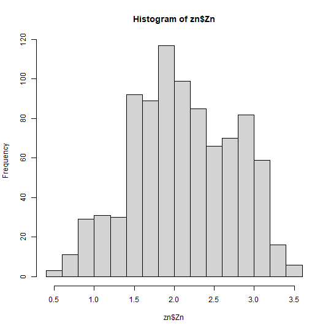
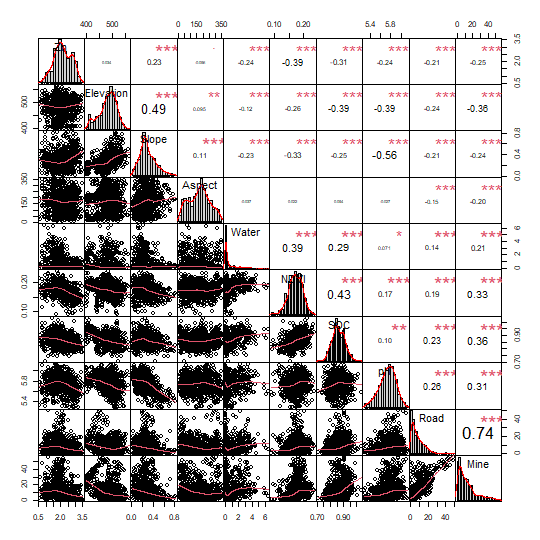
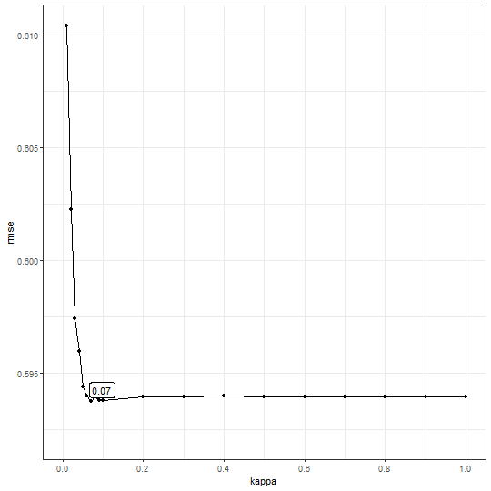
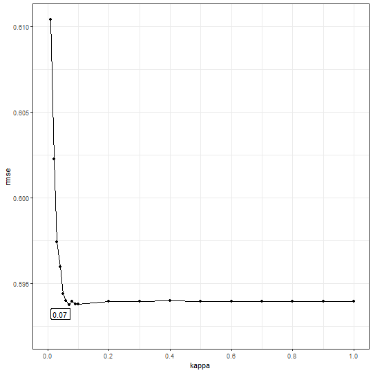
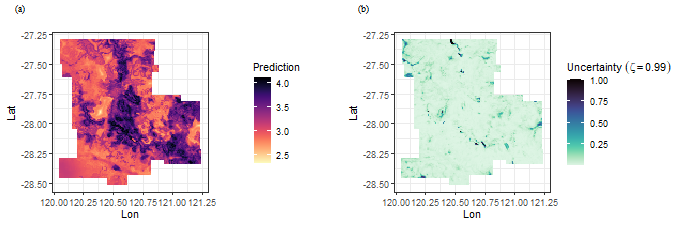

##  GOS model 

This vignette explains how to run a `GOS` model in `spEcula` package.

<div class="figure" style="text-align: center">

<p class="caption">Schematic overview of geographically optimal similarity (GOS) model</p>
</div>

### Load data and package

use `zn` data to train the `gos` model,use `grid` data to predict.


``` r
library(spEcula)

skimr::skim(zn)
```


Table: Data summary

|                         |     |
|:------------------------|:----|
|Name                     |zn   |
|Number of rows           |885  |
|Number of columns        |12   |
|_______________________  |     |
|Column type frequency:   |     |
|numeric                  |12   |
|________________________ |     |
|Group variables          |None |


**Variable type: numeric**

|skim_variable | n_missing| complete_rate|   mean|    sd|     p0|    p25|    p50|    p75|   p100|hist  |
|:-------------|---------:|-------------:|------:|-----:|------:|------:|------:|------:|------:|:-----|
|Lon           |         0|             1| 120.59|  0.27| 120.05| 120.41| 120.55| 120.76| 121.23|▃▇▇▃▃ |
|Lat           |         0|             1| -27.94|  0.30| -28.52| -28.17| -27.98| -27.75| -27.29|▅▆▇▃▃ |
|Zn            |         0|             1|   3.29|  0.71|   1.58|   2.79|   3.23|   3.87|   4.88|▂▆▇▆▃ |
|Elevation     |         0|             1| 481.54| 34.70| 398.89| 462.64| 485.56| 507.04| 562.99|▂▃▇▇▁ |
|Slope         |         0|             1|   0.30|  0.15|   0.01|   0.20|   0.27|   0.39|   0.81|▃▇▃▂▁ |
|Aspect        |         0|             1| 170.97| 86.06|   4.88| 100.28| 176.51| 230.21| 352.60|▅▅▇▅▃ |
|Water         |         0|             1|   0.67|  1.06|   0.00|   0.05|   0.15|   0.80|   6.41|▇▁▁▁▁ |
|NDVI          |         0|             1|   0.17|  0.02|   0.09|   0.16|   0.17|   0.19|   0.24|▁▂▇▆▁ |
|SOC           |         0|             1|   0.86|  0.05|   0.71|   0.83|   0.86|   0.90|   1.03|▁▅▇▃▁ |
|pH            |         0|             1|   5.73|  0.17|   5.28|   5.63|   5.75|   5.85|   6.12|▂▃▇▇▂ |
|Road          |         0|             1|   8.30|  8.17|   0.01|   2.27|   6.14|  12.03|  49.39|▇▃▁▁▁ |
|Mine          |         0|             1|  12.66| 11.78|   0.05|   3.90|   9.09|  17.60|  55.60|▇▃▁▁▁ |


``` r
skimr::skim(grid)
```


Table: Data summary

|                         |      |
|:------------------------|:-----|
|Name                     |grid  |
|Number of rows           |13132 |
|Number of columns        |14    |
|_______________________  |      |
|Column type frequency:   |      |
|numeric                  |14    |
|________________________ |      |
|Group variables          |None  |


**Variable type: numeric**

|skim_variable | n_missing| complete_rate|    mean|      sd|     p0|     p25|     p50|     p75|     p100|hist  |
|:-------------|---------:|-------------:|-------:|-------:|------:|-------:|-------:|-------:|--------:|:-----|
|GridID        |         0|             1| 6566.50| 3791.03|   1.00| 3283.75| 6566.50| 9849.25| 13132.00|▇▇▇▇▇ |
|Lon           |         0|             1|  120.59|    0.30| 120.05|  120.35|  120.57|  120.80|   121.24|▆▇▇▅▃ |
|Lat           |         0|             1|  -27.91|    0.33| -28.51|  -28.19|  -27.93|  -27.63|   -27.30|▆▇▇▆▆ |
|Elevation     |         0|             1|  482.70|   36.70| 398.05|  463.23|  485.13|  508.37|   588.65|▂▅▇▃▁ |
|Slope         |         0|             1|    0.28|    0.16|   0.01|    0.17|    0.25|    0.35|     1.71|▇▂▁▁▁ |
|Aspect        |         0|             1|  171.65|   90.58|   0.75|   94.81|  174.13|  236.72|   358.71|▅▆▇▆▃ |
|Water         |         0|             1|    1.11|    1.19|   0.00|    0.26|    0.65|    1.60|     7.70|▇▂▁▁▁ |
|NDVI          |         0|             1|    0.18|    0.02|   0.06|    0.16|    0.18|    0.19|     0.25|▁▁▆▇▁ |
|SOC           |         0|             1|    0.87|    0.05|   0.69|    0.83|    0.87|    0.91|     1.07|▁▅▇▃▁ |
|pH            |         0|             1|    5.74|    0.18|   5.11|    5.63|    5.75|    5.87|     6.18|▁▂▇▇▂ |
|Road          |         0|             1|    9.82|    8.36|   0.00|    3.31|    7.95|   14.21|    50.14|▇▅▁▁▁ |
|Mine          |         0|             1|   14.79|   12.12|   0.02|    5.54|   11.43|   19.85|    56.64|▇▅▂▁▁ |
|pred          |         0|             1|   30.48|   12.38|  10.94|   20.81|   25.89|   38.44|    76.15|▇▆▃▂▁ |
|uc99          |         0|             1|    0.03|    0.07|   0.00|    0.01|    0.02|    0.03|     1.00|▇▁▁▁▁ |


### Data pre-processing and variable selection

We will use the `zn` data and `grid` data o predict `Zn` in the scope of `grid` data.

From above,we can see that `zn` variable in `Zn` data is skewed (right skewed),so Let's
do a normality test on it.


``` r
moments::skewness(zn$Zn)
## [1] 0.004367706
```

``` r
shapiro.test(zn$Zn)
## 
## 	Shapiro-Wilk normality test
## 
## data:  zn$Zn
## W = 0.98626, p-value = 2.241e-07
```

The Shapiro-Wilk normality test with a $\text{p-value} < 2.2e-16 << 0.05$ and W value of $0.84834$, we can conclude with high confidence that `zn` variable in `Zn` data does not follow a normal distribution.

Now,we transform the `zn` variable in `Zn` data,here I use `Power Transform` method.(ps: you can also use a log-transformation). `Power Transform` uses the maximum likelihood-like approach of Box and Cox (1964) to select a transformation of a `univariate` or multivariate response for normality. First we have to calculate appropriate transformation parameters using `powerTransform()` function of `car` package and then use this parameter to transform the data using `bcPower()` function.


``` r
lambdapt = car::powerTransform(zn$Zn)
lambdapt
## Estimated transformation parameter 
##     zn$Zn 
## 0.8942749
```

``` r
zn$Zn = car::bcPower(zn$Zn,lambdapt$lambda)
```

Now, let's see the transformed `zn` variable in `Zn` data and see the skewness:


``` r
hist(zn$Zn)
```



``` r
moments::skewness(zn$Zn)
## [1] -0.04330951
```

All right, let's move on to the next step to see variable correlation:


``` r
PerformanceAnalytics::chart.Correlation(zn[, c(3:12)],pch = 19)
```



and test multicollinearity use vif:


``` r
m1 = lm(Zn ~ Slope + Water + NDVI + SOC + pH + Road + Mine, data = zn)
car::vif(m1)
##    Slope    Water     NDVI      SOC       pH     Road     Mine 
## 1.651039 1.232454 1.459539 1.355824 1.568347 2.273387 2.608347
```

In this step, the selected variables include Slope, Water, NDVI, SOC, pH, Road, and Mine.

### Determining the optimal similarity


``` r
tictoc::tic()
b1 = bestkappa(Zn ~ Slope + Water + NDVI  + SOC + pH + Road + Mine,
               data = zn,kappa = c(seq(0.01, 0.1, 0.01), seq(0.2, 1, 0.1)),
               nrepeat = 10,nsplit = .8,cores = 1)
tictoc::toc()
## 33.67 sec elapsed
```

``` r
b1$bestkappa
## [1] 0.07
```

``` r
b1$cvmean
## # A tibble: 19 × 2
##    kappa  rmse
##    <dbl> <dbl>
##  1  0.01 0.541
##  2  0.02 0.534
##  3  0.03 0.530
##  4  0.04 0.529
##  5  0.05 0.527
##  6  0.06 0.527
##  7  0.07 0.527
##  8  0.08 0.527
##  9  0.09 0.527
## 10  0.1  0.527
## 11  0.2  0.527
## 12  0.3  0.527
## 13  0.4  0.527
## 14  0.5  0.527
## 15  0.6  0.527
## 16  0.7  0.527
## 17  0.8  0.527
## 18  0.9  0.527
## 19  1    0.527
```

``` r
b1$plot
```



You can set more optional numbers to the `kappa` vector and a higher value of the cross-validation repeat times `nrepeat` with a multi-core parallel(set `cores` bigger).


``` r
tictoc::tic()
b2 = bestkappa(Zn ~ Slope + Water + NDVI  + SOC + pH + Road + Mine,
               data = zn,kappa = c(seq(0.01, 0.1, 0.01), seq(0.2, 1, 0.1)),
               nrepeat = 10,nsplit = .8,cores = 6)
tictoc::toc()
## 10.21 sec elapsed
```

``` r
b2$bestkappa
## [1] 0.07
```

``` r
b2$cvmean
## # A tibble: 19 × 2
##    kappa  rmse
##    <dbl> <dbl>
##  1  0.01 0.541
##  2  0.02 0.534
##  3  0.03 0.530
##  4  0.04 0.529
##  5  0.05 0.527
##  6  0.06 0.527
##  7  0.07 0.527
##  8  0.08 0.527
##  9  0.09 0.527
## 10  0.1  0.527
## 11  0.2  0.527
## 12  0.3  0.527
## 13  0.4  0.527
## 14  0.5  0.527
## 15  0.6  0.527
## 16  0.7  0.527
## 17  0.8  0.527
## 18  0.9  0.527
## 19  1    0.527
```

``` r
b2$plot
```



### Spatial prediction use GOS model


``` r
system.time({
g = gos(Zn ~ Slope + Water + NDVI  + SOC + pH + Road + Mine,
        data = zn, newdata = grid, kappa = 0.07,cores = 6)
})
##    user  system elapsed 
##    0.00    0.00    4.27
```

back transformation using transformation parameters that have used Box-cos transformation


``` r
grid$pred = inverse_bcPower(g$pred,lambdapt$lambda)
grid$uc99 = g$`uncertainty99`
```

show the result


``` r
library(ggplot2)
library(viridis)
library(cowplot)

f1 = ggplot(grid, aes(x = Lon, y = Lat, fill = pred)) +
  geom_tile() +
  scale_fill_viridis(option="magma", direction = -1) +
  coord_equal() +
  labs(fill='Prediction') +
  theme_bw()
f2 = ggplot(grid, aes(x = Lon, y = Lat, fill = uc99)) +
  geom_tile() +
  scale_fill_viridis(option="mako", direction = -1) +
  coord_equal() +
  labs(fill=bquote(Uncertainty~(zeta==0.99))) +
  theme_bw()

plot_grid(f1,f2,nrow = 1,label_fontfamily = 'serif',
          labels = paste0('(',letters[1:2],')'),
          label_fontface = 'plain',label_size = 10,
          hjust = -1.5,align = 'hv')  -> p
p
```


