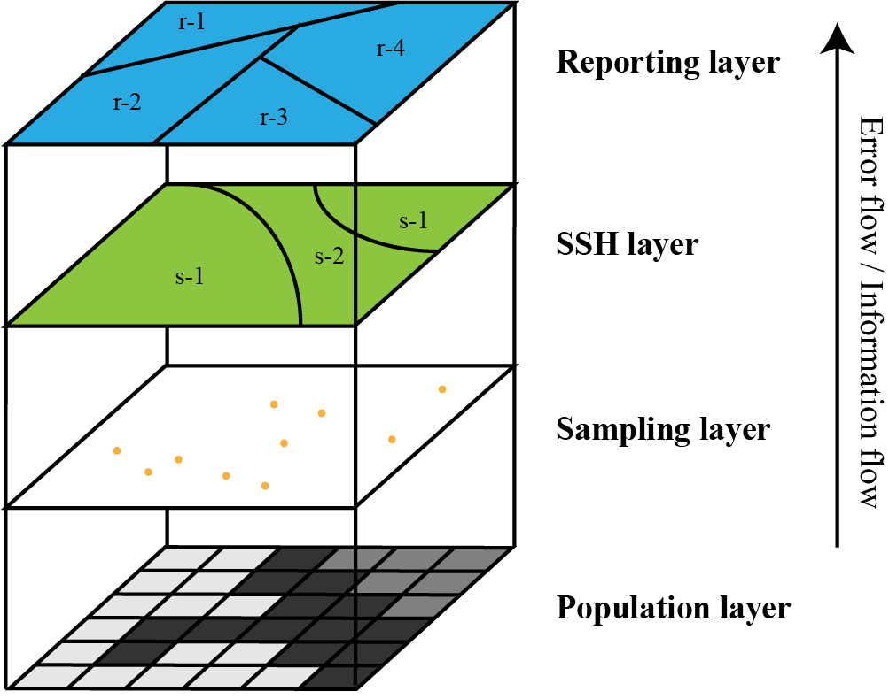

```{r, include = FALSE}
knitr::opts_chunk$set(
  collapse = TRUE,
  comment = "##",
  warning = FALSE,
  message = FALSE
)
```

This vignette explains how to do spatial prediction use `Sandwich Mapping Model` in `spEcula` package.

```{r echo=FALSE, out.width='100%', fig.align="center",fig.cap="Conceptual model of the Sandwich mapping model"}

```

### Load package and data

```{r setup}
library(sf)
library(tidyverse)
library(spEcula)
simpath = system.file("extdata", "sim.gpkg", package="spEcula")
sampling = read_sf(simpath,layer = 'sim_sampling')
ssh = read_sf(simpath,layer = 'sim_ssh')
reporting = read_sf(simpath,layer = 'sim_reporting')
```

```{r echo=FALSE, out.width='100%', fig.align="center",fig.cap="(a) A simulated data set that contains a 20 × 20 grid. The grid is divided into four strata (denoted by thick gray outlines), and a random sample of 41 units is drawn (as denoted by the dots). (b) Seven reporting units whose values are to be inferred. Gray units do not have sampling units falling in."}
knitr::include_graphics('./figure/sandwich_sim_data.png')
```

### visualize the mean and standard deviation of the sample in each stratum

```{r sandwich_sample_distribution,fig.width=5.5,fig.height=3.5}
sampling_zone = sampling %>%
    st_join(ssh['X']) %>%
    st_drop_geometry()

library(ggpubr)

ggerrorplot(sampling_zone, x = "X", y = "Value",
            desc_stat = "mean_sd", color = "black",
            add = "violin", add.params = list(color = "darkgray")) +
  geom_text(data = summarise(sampling_zone,vmean = mean(Value),.by = X), 
            aes(x = X, y = vmean, label = round(vmean,2)), 
            vjust = -0.5, hjust = -0.15, color = "black",size = 3) +
  scale_x_discrete(labels = LETTERS[1:4]) +
  theme(axis.title.x = element_blank())
```

### Run sandwich model for the sim data use `area` weight

```{r}
sim_est = sandwich(sampling = sampling,stratification = ssh,reporting = reporting,
                   sampling_attr = 'Value',ssh_zone = 'X',reporting_id = 'Y',
                   weight_type = 'area')
sim_est
```

see the estimated mean (a) and its standard error (b) returned by the Sandwich mapping model for each of the seven reporting units.

```{r sandwich_sim_est,fig.width=9.5, fig.height=3.5}
library(cowplot) 

f1 = ggplot(data = sim_est, aes(fill = sandwichest_mean), 
            color = "darkgray") +
  geom_sf() + 
  labs(fill='mean') +
  scale_fill_gradient(low = "white", high = "red") +
  theme_bw() +
  theme(
    axis.text = element_blank(),
    axis.ticks = element_blank(),
    axis.title = element_blank(),
    panel.grid = element_blank(),
    legend.position = 'right',
    legend.background = element_rect(fill = 'transparent',color = NA)
  )

f2 = ggplot(data = sim_est, aes(fill = sandwichest_standarderror), 
            color = "darkgray") +
  geom_sf() + 
  labs(fill='se') +
  scale_fill_gradient(low = "white", high = "blue") +
  theme_bw() +
  theme(
    axis.text = element_blank(),
    axis.ticks = element_blank(),
    axis.title = element_blank(),
    panel.grid = element_blank(),
    legend.position = 'right',
    legend.background = element_rect(fill = 'transparent',color = NA)
  )

plot_grid(f1, f2, nrow = 1,label_fontfamily = 'serif',
          labels = paste0('(',letters[1:4],')'),
          label_fontface = 'plain',label_size = 10,
          hjust = -1,align = 'hv')  -> p
p
```


#### Run sandwich model for the sim data use `population` weight

```{r}
sandwich(sampling = sampling,stratification = ssh,reporting = reporting,
         sampling_attr = 'Value',ssh_zone = 'X',reporting_id = 'Y',
         weight_type = 'population')
```

Remember to use `population` weighting when the sample size is large enough, otherwise use `area` weighting.
